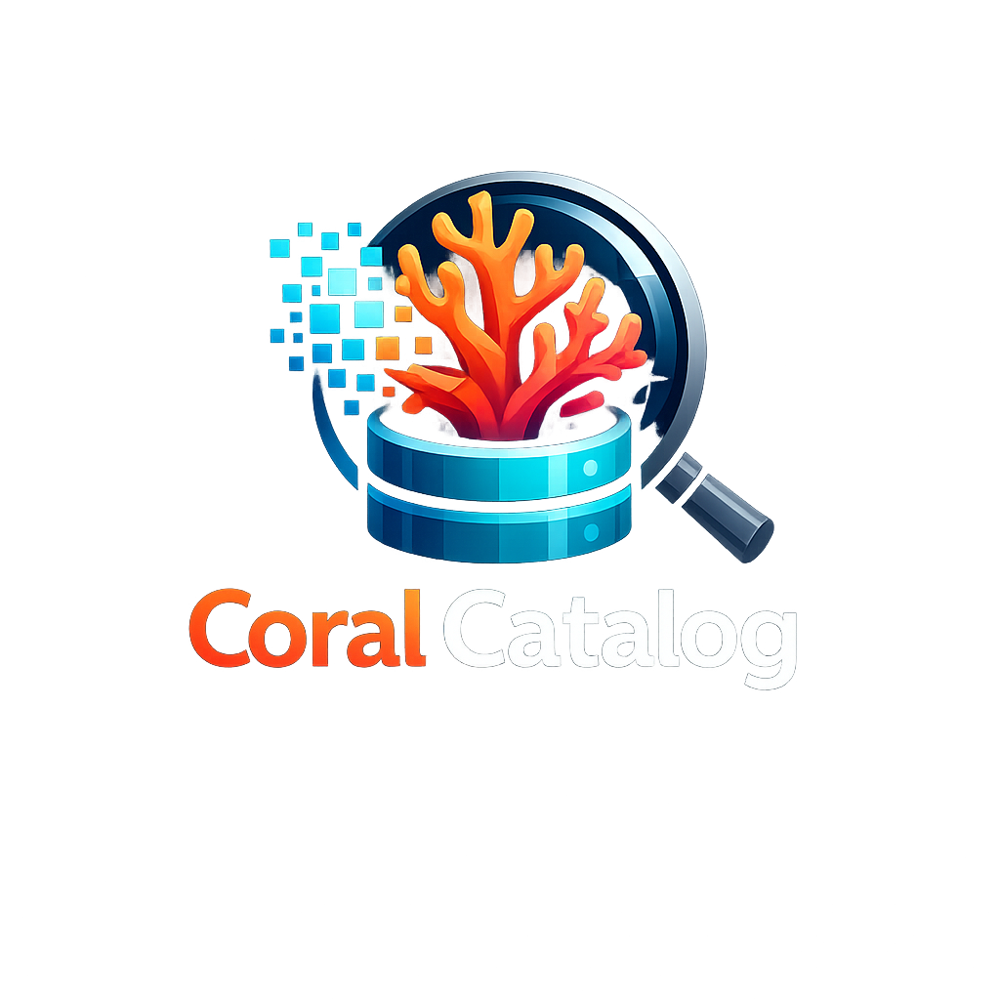
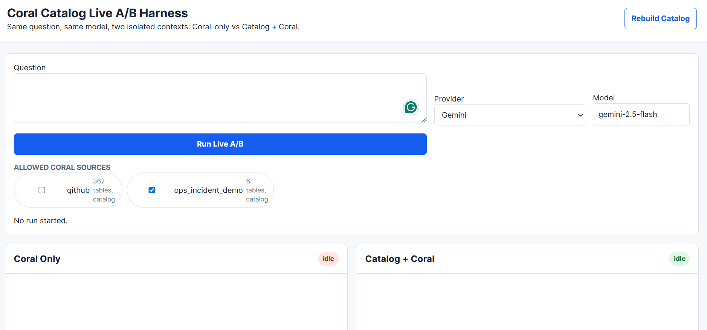

# Coral Catalog

### A Semantic Query-Planning Cache for Coral Agents

Coral Catalog automatically discovers relationships across Coral sources and builds a compact semantic knowledge layer that helps AI agents investigate incidents, generate queries, and retrieve answers using significantly less context, fewer tool calls, and lower cost.

---

## The Problem

Coral makes it easy to query data sources using natural language and SQL generation.

However, as the number of connected sources grows, agents face a different problem:

* Which source should be queried?
* Which tables are relevant?
* Which columns can be joined?
* What investigation path connects the data?
* How can the agent avoid loading massive schema context?

A typical investigation may require reasoning across:

* GitHub Pull Requests
* Deployments
* Incidents
* Slack Messages
* Support Tickets
* Sentry Events

Without prior knowledge, agents spend time and tokens discovering relationships before they can begin solving the actual problem.

This results in:

* Excessive context usage
* More tool calls
* Longer latency
* Higher cost
* Lower reliability

---

## My Insight

Traditional caches (Redis, Memcached, etc.) store answers.

Coral Catalog stores **how to find answers**.

Instead of caching query results, Coral Catalog precomputes and stores:

* Schema intelligence
* Join relationships
* Source routing knowledge
* Investigation paths
* Query recipes

This acts as a **semantic query-planning cache** for Coral agents.

---

## Solution

Coral Catalog automatically:

1. Inspects Coral sources
2. Discovers tables and schemas
3. Detects likely relationships and joins
4. Generates semantic documentation
5. Produces optimized retrieval-ready context
6. Guides agents toward relevant data with minimal context

The result:

* Smaller prompts
* Fewer tool calls
* Faster investigations
* Lower token consumption
* Better agent planning

---

# Architecture

```text
                     Coral Sources
                           │
                           ▼
                ┌──────────────────┐
                │ Catalog Builder  │
                └──────────────────┘
                           │
                           ▼
                ┌──────────────────┐
                │ Schema Analysis  │
                └──────────────────┘
                           │
                           ▼
                ┌──────────────────┐
                │ Join Discovery   │
                └──────────────────┘
                           │
                           ▼
                ┌──────────────────┐
                │ Catalog Renderer │
                └──────────────────┘
                           │
                           ▼
                ┌──────────────────┐
                │ Context Optimizer│
                └──────────────────┘
                           │
                           ▼
                 Optimized Catalog
                           │
                           ▼
                     Coral Agent
                           │
                           ▼
                     Investigation
```

---

# Catalog Generation Pipeline

## 1. Source Discovery

Coral Catalog reads configured Coral sources and extracts:

* Tables
* Columns
* Metadata
* Relationships
* Source descriptions

Output:

```text
Raw Catalog
```

---

## 2. Relationship Discovery

The system identifies likely joins using naming conventions and schema patterns.

Examples:

```text
incident_id
deployment_id
pr_id
user_id
```

Discovered relationships become part of the semantic knowledge layer.

Example:

```text
PR
 ↓
Deployment
 ↓
Incident
 ↓
Slack
 ↓
Support Ticket
```

---

## 3. Semantic Annotation

Catalog entries are enriched with:

* Human-readable descriptions
* Investigation hints
* Relationship information
* Source context

Output:

```text
Annotated Catalog
```

---

## 4. Context Optimization

Large schemas are transformed into compact retrieval-oriented summaries.

Instead of exposing every table and column to the model, the optimizer creates:

* Source summaries
* Query recipes
* Investigation guides
* Relationship maps

Output:

```text
Optimized Catalog
```

---

# Why Not Traditional caching systems?

Traditional caching systems like Redis caches results.

Example:

```text
Question
 ↓
Answer
```

Coral Catalog caches understanding.

Example:

```text
Question
 ↓
Relevant Source
 ↓
Relevant Tables
 ↓
Relevant Relationships
 ↓
Efficient Query Plan
 ↓
Answer
```

Redis helps after a query is known.

Coral Catalog helps discover the query itself.

---

# Live A/B Evaluation Harness


To validate the approach, Coral Catalog includes a live benchmarking system.

The same:

* Question
* Model
* Provider
* Data Source

are executed in two isolated environments:

## A: Coral Only

Agent receives only Coral source information.

## B: Catalog + Coral

Agent receives Coral plus optimized catalog intelligence.

This allows direct comparison of:

* Prompt tokens
* Completion tokens
* Total tokens
* Tool calls
* Investigation efficiency

NOTE:
All these metrics are captured from the metadata provided by the models themselves, so that the results are genuine and unbiased. 

---

# Example Benchmark

Question:

```text
Investigate the enterprise SSO login incident. Identify the causal PR, deployment, incident ID, Sentry/support impact, Slack/customer evidence, and rollback or follow-up fixes.
```

Results:

| Metric            | Coral Only | Catalog + Coral |
| ----------------- | ---------- | --------------- |
| Prompt Tokens     | 8,265      | 2,725           |
| Completion Tokens | 507        | 186             |
| Total Tokens      | 8,772      | 2,911           |
| Tool Calls        | 5          | 1               |

### Improvements

* ~67% reduction in prompt tokens
* ~67% reduction in total token usage
* 80% reduction in tool calls

These improvements were achieved while solving the same investigation task.

---

# Demo Dataset


To demonstrate realistic cross-source investigations, the repository includes an incident response dataset containing:

* GitHub Pull Requests
* Deployments
* Production Incidents
* Slack Conversations
* Support Tickets
* Sentry Events

This creates realistic investigation chains:

```text
Incident
 ↓
Deployment
 ↓
Pull Request
 ↓
Slack Discussion
 ↓
Customer Impact
```
---

# Future Work

* Graph-based relationship visualization
* Vector retrieval over catalog artifacts
* Automatic query-plan generation
* Accuracy scoring and benchmark suites
* Incremental catalog updates

---

# Project Vision

Coral Catalog is not a replacement for Coral.

Coral remains the execution layer responsible for querying data.

Coral Catalog acts as a semantic reasoning layer that helps AI agents understand complex data ecosystems before they query them.

The long-term goal is to enable agents to navigate large collections of Coral sources with the same efficiency that traditional databases achieve through indexes and query planners.

In that sense, Coral Catalog functions as a semantic cache and query planning layer for AI-driven data investigations.